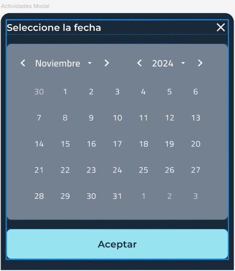

<!--
This README describes the package. If you publish this package to pub.dev,
this README's contents appear on the landing page for your package.

For information about how to write a good package README, see the guide for
[writing package pages](https://dart.dev/tools/pub/writing-package-pages).

For general information about developing packages, see the Dart guide for
[creating packages](https://dart.dev/guides/libraries/create-packages)
and the Flutter guide for
[developing packages and plugins](https://flutter.dev/to/develop-packages).
-->

# DatePickerTextField

`DatePickerTextField` is a customizable widget that combines a `TextFormField` with a date picker, providing a user-friendly date input experience.

## Features

- Combines a text field with a popup date picker.
- Customizable text field appearance and calendar style.
- Supports external controllers and validation.
- Option to select only future dates.
- Customizable confirm and cancel buttons.
- Flexible date format support.

## Installation

Add the following line to your `pubspec.yaml` file to include the package in your project:

```yaml
dependencies:
  date_picker_textfield: ^1.0.0
```

## Usage

Here’s an example of how to use the DatePickerTextField widget in your project:

```dart
DatePickerTextField(
controller: myController,
validator: (value) {
if (value == null || value.isEmpty) {
return 'Please select a date';
}
return null;
},
onChanged: (value) => print('Selected date: $value'),
)
```



## Properties

- controller: A TextEditingController to manage the text input. Defaults to a new TextEditingController if not provided.
- validator: A function that validates the entered date. If not provided, no validation is performed.
- onChanged: A callback that fires when the date is changed.
- dateFormat: Specifies the date format. Defaults to 'dd-MM-yyyy'.
- selectableFutureOnly: If set to true, only future dates can be selected. Defaults to true.
- confirmButtonText: Custom text for the confirmation button in the calendar modal. Defaults to 'Aceptar'.
- cancelButtonText: Custom text for the cancel button. Defaults to 'Cancelar'.
- suffixIcon: A widget displayed at the end of the input field, usually a calendar icon.

## Contributing

We welcome contributions! If you’d like to contribute to this project, please follow these steps:

Fork the repository
Create a new branch
Make your changes
Submit a pull request

Support Me
If you find this project helpful, consider buying me a coffee!

[](https://www.buymeacoffee.com/eliecerabsalongarcia)
License
This project is licensed under the MIT License - see the LICENSE file for details.

Acknowledgements
Flutter and Dart for building the app
intl package for date formatting
MUI for providing useful components
